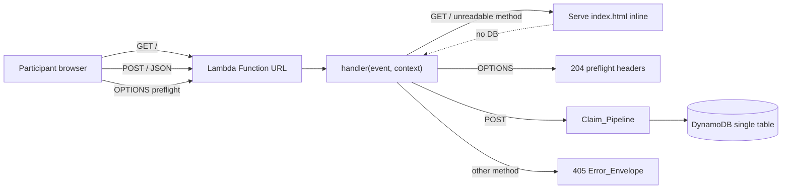

# Design Document

## Overview

The Credential Claim Service already carries its full correctness core in
`claim-service/lambda/claim_handler.py` — email helpers, body parsing, the
per-IP rate counter, and the race-proof `claim`/`reclaim` transaction — plus a
self-contained `index.html`, Terraform for a single Python 3.12 Lambda behind
one Function URL, and seed/audit scripts. The one missing piece is the symbol
the Terraform points at: `claim_handler.handler`. Because that entrypoint does
not exist, the Lambda is undeployable.

This feature adds that thin wiring layer and nothing more. It introduces:

- a top-level `handler(event, context)` entrypoint resolvable as
  `claim_handler.handler` (R1);
- method routing on the single Function URL — GET serves the page, POST runs
  the claim, OPTIONS answers the preflight, other methods get 405, and an
  unreadable method is treated as GET (R2);
- inline serving of the packaged `index.html` (R3);
- two new module-level config reads, `WORKSHOP_CODE` and `ALLOWED_ORIGIN` (R4);
- a constant-time workshop-code eligibility gate (R5);
- the POST `Claim_Pipeline` composed from the existing building blocks in a
  fixed order (R6);
- `ClaimError` → `{"error": message}` envelope mapping and a fixed 500 for any
  other exception (R7);
- a success projection reusing the existing `_credential_response` (R8);
- `Resolved_Origin` derivation and uniform CORS/response headers (R9);
- strict preservation of the existing transaction — the handler only composes,
  never reimplements (R10);
- an explicit scope boundary excluding the mise task wiring (R11).

**Design stance.** The handler is wiring, not logic. Every decision below traces
to a requirement, and every behavior the service already proves (atomic
one-per-email / one-per-credential, idempotent re-claim, the per-IP cap) is
reached by *calling* the existing function unchanged, never by re-deriving it.
The guiding invariant: the handler is a pure composition over fixed contracts,
plus two side effects it does not own (reading `index.html`; delegating to
`claim`).

### Design decisions and rationale

| Decision | Rationale | Requirement |
| --- | --- | --- |
| Single `try/except` wraps the whole dispatch | One place converts any `ClaimError` to its mapped status and any other exception to a fixed 500, so no step can leak an unmapped failure | R1.2, R7.1, R7.2 |
| `body` is always built as a string by a response builder | The Function URL serializes the dict's `body` verbatim; a non-string would be mishandled | R1.3, R7.3 |
| Read `index.html` once at module import, cache in a module global | 128 MB / 10 s Lambda, a static ~15 KB file; a read-once cache removes per-request disk I/O and is reused across warm invocations, matching the existing `_table` memoization style | R3 |
| Workshop gate uses `hmac.compare_digest` | Constant-time comparison so timing does not leak how many leading characters matched | R5.2 |
| Gate runs *after* cap + parse + format validation, *before* claim | Ordering is fixed by the requirement; it also means the gate only ever sees a present `workshop_code` (parse already 400s a missing one) | R5.4, R6.1 |
| `cors_headers()` / response-builder helpers set ACAO in exactly one place | Guarantees exactly one `Access-Control-Allow-Origin` equal to `Resolved_Origin` on every path | R9.3, R9.5 |
| Handler composes existing functions only; no new read-then-write | Preserves the proven race-proof / idempotent core verbatim | R10.1, R10.3 |
| stdlib `hmac` + already-present `boto3`; no new dependency | Keeps the deployment package to handler + `index.html`, free-tier and cold-start friendly | (scope) |

## Architecture

The service is one Python 3.12 Lambda fronted by exactly one Function URL
(`authorization_type = NONE`), already defined in `terraform/lambda.tf`. There
is no API Gateway and no WAF. The deployment package zips `claim_handler.py` and
`index.html` so the page is a sibling of the handler at the package root.



Two layers only:

- **Wiring layer (this feature):** `handler` + small helpers
  (`verify_workshop_code`, `cors_headers`, `json_response`, `html_response`,
  method extraction, the page cache). Pure composition plus two side effects it
  does not own (reading the cached page; calling `claim`).
- **Correctness core (fixed, unchanged):** `parse_post`, `normalize_email`,
  `is_valid_email`, `source_ip`, `check_and_increment_ip`, `claim`, `reclaim`,
  `_credential_response`, `ClaimError`.

Only the POST path reaches DynamoDB (through the per-IP counter and the claim
transaction). GET, OPTIONS, 405, and every pre-claim rejection return without a
single DynamoDB call.

## Components and Interfaces

All additions live in `claim_handler.py` alongside the existing contracts. No
new module, no new file.

### Module-level additions (read once at import)

```python
# New config reads (R4). WORKSHOP_CODE has no safe permissive default — see
# "fail-closed" discussion in Data Models.
CONFIGURED_WORKSHOP_CODE = os.environ.get("WORKSHOP_CODE", "")
ALLOWED_ORIGIN = os.environ.get("ALLOWED_ORIGIN", "")

# Read-once page cache. Resolved relative to this module so it works at the
# deployment-package root where index.html is a sibling of claim_handler.py.
_PAGE_PATH = os.path.join(os.path.dirname(__file__), "index.html")
_PAGE_HTML: str | None = None  # populated lazily by _load_page()
```

### `handler(event, context) -> dict`  (R1, R2, R7)

The single entrypoint AWS invokes. Resolves the method, dispatches, and wraps
everything in one `try/except` so no failure escapes unmapped.

```python
def handler(event, context):
    origin = resolve_origin()                     # R9.1, R9.2
    try:
        method = request_method(event)            # R2 (case-insensitive)
        if method == "OPTIONS":
            return preflight_response(origin)      # R2.3, R9.4
        if method == "POST":
            return json_response(200, run_claim_pipeline(event), origin)  # R2.2, R6.6, R8
        if method in ("GET", ""):                  # "" == unreadable → GET (R2.5)
            return html_response(origin)           # R2.1, R3
        return json_response(405, {"error": "method not allowed"}, origin)  # R2.4
    except ClaimError as exc:
        return json_response(exc.status, {"error": exc.message}, origin)    # R7.1
    except Exception:                               # noqa: BLE001 — fixed 500 (R7.2)
        return json_response(500, {"error": "internal error"}, origin)
```

Notes:
- `resolve_origin()` runs before the `try` so even a 500 carries CORS headers
  (R9.3). It only reads a module string and cannot raise.
- The bare `except Exception` returns a fixed message with no exception type,
  detail, stack trace, email, or OTP (R7.2, R7.4). It deliberately logs nothing
  that would include request content; see "PII discipline".

### `request_method(event) -> str`  (R2.5)

```python
def request_method(event) -> str:
    raw = (
        event.get("requestContext", {})
        .get("http", {})
        .get("method")
    )
    if not isinstance(raw, str) or raw == "":
        return ""          # sentinel: treat as GET downstream
    return raw.upper()     # case-insensitive comparison (R2.1–R2.4)
```

Absent / empty / non-string method → `""`, which `handler` maps to the GET page
(R2.5). Any present string is upper-cased so `get`, `Post`, `options` all match.

### `_load_page() -> str`  (R3)

```python
def _load_page() -> str:
    global _PAGE_HTML
    if _PAGE_HTML is None:
        with open(_PAGE_PATH, encoding="utf-8") as fh:
            _PAGE_HTML = fh.read()
    return _PAGE_HTML
```

Read-once, cached in a module global (same pattern as the existing `_table`
memoization). A failure to read raises `OSError`, which `html_response` catches
and converts to a 500 `Error_Envelope` (R3.3) — see below.

### `verify_workshop_code(submitted: str) -> None`  (R5)

```python
def verify_workshop_code(submitted: str) -> None:
    candidate = submitted.strip()                       # R5.1 (trim submitted)
    if candidate == "":
        raise ClaimError(403, "invalid workshop code")  # R5.3 (empty after trim)
    if not hmac.compare_digest(candidate, CONFIGURED_WORKSHOP_CODE):  # R5.2
        raise ClaimError(403, "invalid workshop code")  # R5.3 (wrong code)
```

- Only reached for a *present* `workshop_code`: `parse_post` already raises
  400 for a missing field (R6.3), so this gate's `submitted` is never `None`.
  This is the reconciliation of R5.3 with R6.3 — "missing" is a 400 (parse),
  "present-but-wrong/empty" is a 403 (gate).
- `hmac.compare_digest` is the stdlib constant-time comparison (R5.2). It
  requires both operands be `str`; `candidate` is a trimmed string and
  `CONFIGURED_WORKSHOP_CODE` is a module string, so the comparison is safe.
- Raising *before* `normalize_email` and `claim` guarantees a wrong/empty code
  touches no credential, locks no email, and never normalizes-for-claim
  (R5.3, R5.4).

### `run_claim_pipeline(event) -> dict`  (R6)

Composes the existing functions in the fixed order. Returns the credential dict
on success; raises `ClaimError` at the first failing step.

```python
def run_claim_pipeline(event) -> dict:
    ip = source_ip(event)
    check_and_increment_ip(ip, PER_IP_CAP)      # 1. per-IP cap  → 429 (R6.2)
    fields = parse_post(event)                  # 2. body parse  → 400 (R6.3)
    if not is_valid_email(fields["email"]):     # 3. email format
        raise ClaimError(400, "email is not valid")        # (R6.4)
    verify_workshop_code(fields["workshop_code"])          # 4. gate → 403 (R5)
    email = normalize_email(fields["email"])    # 5. normalize   (R6.5)
    return claim(email)                         # 6. claim → 200 / 409 (R6.6)
```

The per-IP cap runs **before** body parse (R6.2): an IP already over the cap is
rejected with 429 without the body being parsed, the code verified, or a
credential touched.

### Response builders  (R7.3, R8.2, R9)

```python
def resolve_origin() -> str:
    return ALLOWED_ORIGIN if ALLOWED_ORIGIN else "*"   # R9.1, R9.2

def cors_headers(origin: str) -> dict:
    return {"Access-Control-Allow-Origin": origin}     # exactly one ACAO (R9.3, R9.5)

def json_response(status: int, obj: dict, origin: str) -> dict:
    headers = cors_headers(origin)
    headers["Content-Type"] = "application/json"       # R7.3, R8.2
    return {"statusCode": status, "headers": headers, "body": json.dumps(obj)}

def html_response(origin: str) -> dict:
    try:
        page = _load_page()                            # R3.1, R3.2
    except OSError:
        return json_response(500, {"error": "internal error"}, origin)  # R3.3
    headers = cors_headers(origin)
    headers["Content-Type"] = "text/html; charset=utf-8"                # R2.1
    return {"statusCode": 200, "headers": headers, "body": page}

def preflight_response(origin: str) -> dict:
    headers = cors_headers(origin)
    headers["Access-Control-Allow-Methods"] = "GET, POST"   # R9.4
    headers["Access-Control-Allow-Headers"] = "content-type"
    return {"statusCode": 204, "headers": headers, "body": ""}  # empty body, R2.3
```

Every builder funnels ACAO through `cors_headers`, so exactly one
`Access-Control-Allow-Origin` equal to `Resolved_Origin` appears on every path —
GET page, POST success, OPTIONS, and all errors (R9.3, R9.5). `body` is always a
string (`json.dumps(...)`, the page text, or `""`), satisfying R1.3.

### Reused, unchanged

`_credential_response` already projects a `CRED#` item to exactly
`username`/`otp`/`sign_in_url`/`region` and is called *inside* `claim`/`reclaim`
(R8.1, R8.3, R10). The handler returns `claim`'s dict verbatim; it does not
re-project or add fields.

## Data Models

The handler introduces no new persisted data. The DynamoDB single-table model
(`CRED#`, `EMAIL#`, `RATE#` items) is owned by the existing core and untouched
here. The data this feature *shapes* is the Function URL request/response
envelope and the module config.

### Function URL event (input, read-only)

```jsonc
{
  "requestContext": { "http": { "method": "POST", "sourceIp": "203.0.113.4" } },
  "body": "{\"email\": \"a@b.com\", \"workshop_code\": \"swarm-42\"}",
  "isBase64Encoded": false
}
```

The handler reads only `requestContext.http.method` (via `request_method`) and
delegates `sourceIp` + `body` + `isBase64Encoded` handling to the existing
`source_ip` / `parse_post`. It never trusts any other event field.

### Function URL response (output)

```jsonc
{
  "statusCode": 200,
  "headers": {
    "Content-Type": "application/json",            // or text/html; charset=utf-8
    "Access-Control-Allow-Origin": "<Resolved_Origin>"
    // OPTIONS adds Access-Control-Allow-Methods + Access-Control-Allow-Headers
  },
  "body": "<string>"                                 // JSON text, page HTML, or ""
}
```

Invariants on every response: `statusCode` is an int, `headers` is a map with
exactly one `Access-Control-Allow-Origin` equal to `Resolved_Origin`, and `body`
is a string (R1.2, R1.3, R9.3).

### Success body (`Credential_Response`)

Exactly four fields, produced by the existing `_credential_response` and
JSON-encoded by `json_response`:

```json
{ "username": "...", "otp": "...", "sign_in_url": "...", "region": "<AWS_REGION, default us-east-1>" }
```

### Error body (`Error_Envelope`)

```json
{ "error": "<message>" }
```

For a `ClaimError` the `error` carries the message verbatim (R7.1); for any
other exception it is the fixed `"internal error"` with no type/detail/trace,
email, or OTP (R7.2).

### Module configuration (read once at import, R4)

| Name | Source env var | Default when unset | Used by |
| --- | --- | --- | --- |
| `CONFIGURED_WORKSHOP_CODE` | `WORKSHOP_CODE` | `""` (empty) | `verify_workshop_code` |
| `ALLOWED_ORIGIN` | `ALLOWED_ORIGIN` | `""` (empty → `Resolved_Origin = "*"`) | `resolve_origin` |

**Fail-closed choice for `WORKSHOP_CODE`.** The requirement says only that the
module reads `WORKSHOP_CODE` at import (R4.1); it does not define a default. We
default to the empty string and let the gate stay strict rather than inventing a
permissive fallback. The effect is **fail-closed**: if `WORKSHOP_CODE` is unset
(or empty), `CONFIGURED_WORKSHOP_CODE == ""`, and `verify_workshop_code` rejects
*every* submission — a non-empty trimmed candidate never equals `""` under
`compare_digest`, and an empty candidate is rejected by the explicit empty check
(R5.3). This is the safe failure mode for an eligibility gate: a
misconfigured deployment denies access rather than letting anyone claim. In
practice the Terraform marks `workshop_code` as required+sensitive, so a real
deploy always injects it; the fail-closed default only governs the
misconfiguration edge. We deliberately do **not** make an unset code
"permissive" (allow all), because that would silently disable the gate the
product requires.

`ALLOWED_ORIGIN` defaulting to empty is specified directly (R4.2) and maps to
`Resolved_Origin = "*"` (R9.2), mirroring the Function URL CORS fallback in
`lambda.tf`.

## Correctness Properties

*A property is a characteristic or behavior that should hold true across all
valid executions of a system — essentially, a formal statement about what the
system should do. Properties serve as the bridge between human-readable
specifications and machine-verifiable correctness guarantees.*

The handler is wiring, so most of its guarantees are universal invariants over
*all* events rather than one-off examples. The properties below were derived
from the acceptance-criteria prework and then consolidated to remove redundancy
(e.g. the response-shape, body-is-string, Content-Type, and single-ACAO
criteria all fold into one "well-formed response" invariant). Each is intended
to be realized by a single property-based test.

### Property 1: Every response is well-formed

*For any* Function URL event — any method, any body, any `ALLOWED_ORIGIN`, and
whether the request succeeds or fails — the handler's return is a dict whose
`statusCode` is an int, whose `headers` is a map carrying exactly one
`Access-Control-Allow-Origin` equal to `Resolved_Origin` (`ALLOWED_ORIGIN` when
non-empty, else `"*"`), and whose `body` is a string; and whenever that body is
JSON its `Content-Type` is `application/json`.

**Validates: Requirements 1.2, 1.3, 7.3, 8.2, 9.1, 9.2, 9.3, 9.5**

### Property 2: GET (and any unreadable method) serves the page without touching DynamoDB

*For any* event whose method equals `GET` case-insensitively, or whose method is
absent, empty, or not a string, the handler returns `statusCode` 200, a
`Content-Type` of `text/html; charset=utf-8`, a `body` equal to the packaged
`index.html` contents, and makes no DynamoDB call.

**Validates: Requirements 2.1, 2.5, 3.2**

### Property 3: OPTIONS yields the preflight response

*For any* event whose method equals `OPTIONS` case-insensitively, and any
`ALLOWED_ORIGIN`, the handler returns `statusCode` 204, an empty-string `body`,
an `Access-Control-Allow-Origin` equal to `Resolved_Origin`, an
`Access-Control-Allow-Methods` of exactly `GET, POST`, and an
`Access-Control-Allow-Headers` of exactly `content-type`.

**Validates: Requirements 2.3, 9.4**

### Property 4: Unknown methods are rejected with 405

*For any* non-empty method string that is not `GET`, `POST`, or `OPTIONS`
(compared case-insensitively), the handler returns `statusCode` 405 with an
`Error_Envelope` body and makes no DynamoDB call.

**Validates: Requirements 2.4**

### Property 5: The pipeline fails at the first failing step, in fixed order

*For any* POST event, the status returned is that of the earliest failing stage
in the fixed order per-IP cap (429) → body parse (400) → email-format (400) →
workshop-code gate (403) → claim (200/409), and no later stage runs or produces
a side effect when an earlier stage fails. In particular an over-cap IP yields
429 regardless of body or code, a malformed body yields 400 before the gate is
consulted, and an invalid email yields 400 before the gate is consulted.

**Validates: Requirements 5.4, 6.1, 6.2, 6.3, 6.4**

### Property 6: A wrong or empty workshop code never writes

*For any* valid email and *any* submitted workshop code that is empty after
trimming or not byte-for-byte equal to `CONFIGURED_WORKSHOP_CODE`, a POST
returns `statusCode` 403 with an `Error_Envelope`, and the DynamoDB table is
left byte-for-byte unchanged — no `EMAIL#` lock is created, no `CRED#` item
changes status, and `claim` is never invoked with a normalized email.
Conversely, *for any* amount of surrounding whitespace around the correct code,
the gate accepts and the pipeline proceeds to the claim step.

**Validates: Requirements 5.1, 5.3**

### Property 7: Only a normalized email reaches `claim`

*For any* valid submitted email, regardless of its letter case or surrounding
whitespace, the value passed to the existing `claim` function equals
`normalize_email(submitted_email)`.

**Validates: Requirements 6.5, 10.3**

### Property 8: A successful claim returns exactly the four credential fields

*For any* seeded pool with at least one available credential, a valid POST
(correct code, valid email) returns `statusCode` 200 and a JSON body whose key
set is exactly `{username, otp, sign_in_url, region}` — no fewer and no extra
attributes — matching the assigned credential's seeded values.

**Validates: Requirements 6.6, 8.1, 8.3**

### Property 9: Re-claim is idempotent

*For any* seeded pool and *any* valid email, two POSTs with that same email and
the correct code (even with differing case or whitespace between the two
submissions) each return `statusCode` 200 with byte-identical credential bodies,
via the existing idempotent re-claim path.

**Validates: Requirements 10.2**

### Property 10: `ClaimError` maps to its status and verbatim message

*For any* `ClaimError(status, message)` raised by any pipeline step (status in
{400, 403, 409, 429}), the handler returns a response whose `statusCode` equals
`status` and whose body is `{"error": message}` with the message carried
verbatim.

**Validates: Requirements 7.1**

### Property 11: Errors never leak exception detail, email, or OTP

*For any* exception that is not a `ClaimError` raised during a request — even one
whose own message embeds the submitted email or an OTP — the handler returns
`statusCode` 500 with a fixed `Error_Envelope` whose `error` field contains none
of the exception's type, detail, or stack trace; and across *every* error path,
neither the submitted raw email nor any OTP value appears in the response body
or in any log line emitted for that request.

**Validates: Requirements 7.2, 7.4**

### Non-goal (correctness preservation)

The handler **composes** the existing core and adds no new read-then-write
uniqueness check on the claim path; the atomic `TransactWriteItems` and the
idempotent re-claim in `claim`/`reclaim` are **not modified** by this feature
(R10.1). Properties 6, 7, and 9 exercise this delegation behaviorally; the
"no new transaction logic" guarantee itself is a structural non-goal confirmed
by review, not a generated property.

## Error Handling

All failures converge on one place: the single `try/except` in `handler`. A
`ClaimError` becomes `{"error": message}` at its own status; any other exception
becomes a fixed-message 500. Every error response still carries the uniform CORS
and `Content-Type: application/json` headers because it is built by
`json_response`.

### Status taxonomy

| Status | Raised by / when | Body |
| --- | --- | --- |
| 400 | `parse_post` (absent / non-JSON / non-object / missing field); invalid email format | `{"error": "<parse or email message>"}` |
| 403 | `verify_workshop_code` (empty-after-trim or wrong code) | `{"error": "invalid workshop code"}` |
| 405 | method is a non-empty value other than GET/POST/OPTIONS | `{"error": "method not allowed"}` |
| 409 | `claim` / `reclaim` (pool exhausted, retry budget spent) | `{"error": "all claimed"}` |
| 429 | `check_and_increment_ip` (per-IP cap exceeded) | `{"error": "too many attempts; please try again later"}` |
| 500 | GET page read failure (R3.3); any non-`ClaimError` exception (R7.2) | `{"error": "internal error"}` (fixed, no detail) |

Notes:
- 400 covers two distinct steps (parse and email-format) that both map to the
  same status by the requirements; the earlier (parse) wins when both would
  fail, per Property 5.
- The 500 body is a constant. It never includes the exception type, message,
  stack trace, submitted email, or any OTP (R7.2, R7.4).
- The GET page-read failure reuses the same 500 envelope (R3.3) rather than
  inventing a separate code.

### PII discipline (R7.4)

- The handler emits **no log line containing the raw submitted email or an OTP**.
  The success projection and all error envelopes carry only non-PII fields; the
  fixed 500 body carries no request content at all.
- What is safe to log, if logging is added: the resolved method, the response
  `statusCode`, the `source_ip` (already treated as operational metadata by the
  existing rate counter), and an outcome category (e.g. `rate_limited`,
  `bad_request`, `forbidden`, `claimed`, `exhausted`, `error`). None of these
  include the email local part, the email as a whole, or the OTP.
- The `otp` and `sign_in_url` appear only in the success *response body* sent to
  the claiming participant — never in logs.

## Testing Strategy

Tests live in `claim-service/tests/` and extend the existing pytest + Hypothesis
+ moto harness. `conftest.py` already puts `claim-service/lambda/` on
`sys.path` (so `import claim_handler` works) and pins `AWS_REGION` (to the
`us-east-1` default fallback) before import so moto resolves a concrete
region, exactly what the handler tests need.
No new third-party dependency is introduced: the handler uses only the stdlib
(`json`, `os`, `hmac`) and the already-present `boto3`; the tests use the
already-present `pytest`, `hypothesis`, and `moto`.

### Dual approach

- **Unit / example tests** cover the structural and single-scenario criteria:
  handler existence and arity (R1.1); the import-time config reads for
  `WORKSHOP_CODE` and `ALLOWED_ORIGIN`, including the unset→`""` default
  (R4.1, R4.2); the on-disk GET body equals the packaged `index.html` (R3.1);
  the `index.html`-unreadable → 500 edge (R3.3); and the structural check that
  `verify_workshop_code` uses `hmac.compare_digest` (R5.2, which cannot be
  asserted as a wall-clock timing property reliably).
- **Property tests** cover the universal invariants (Properties 1–11 above),
  one property-based test per property, each tagged with its design property.

### Simulating Function URL events

A small test helper builds the Function URL event shape the handler reads:

```python
def make_event(method=None, body=None, source_ip="203.0.113.1",
               is_base64=False):
    http = {}
    if method is not None:
        http["method"] = method          # may be a non-string for R2.5 cases
    http["sourceIp"] = source_ip
    event = {"requestContext": {"http": http}}
    if body is not None:
        event["body"] = body
        event["isBase64Encoded"] = is_base64
    return event
```

Hypothesis strategies drive the variation: method strings (including random
tokens for Property 4 and non-string / missing values for Property 2), JSON and
non-JSON bodies, emails with mixed case and surrounding whitespace, and
workshop-code candidates with whitespace padding and wrong values.

### Reusing the DynamoDB fixture

The POST-path properties (5 partial, 6, 8, 9) need a table. They reuse the exact
pattern the existing property tests already use (see
`test_claim_success_contents_property.py` and `test_per_ip_cap_property.py`):

1. enter `with mock_aws():`;
2. create the single-table schema (`PK` string hash key, PAY_PER_REQUEST, TTL on
   `ttl`);
3. reset the handler's memoized state —
   `claim_handler.TABLE_NAME = TABLE_NAME`, `claim_handler._dynamodb = None`,
   `claim_handler._table = None` — then point `_table` at the fresh moto table;
4. for transaction-driving examples, apply the same moto-5
   `transact_write_items` standalone-client workaround the existing success
   property test documents (it changes no handler behavior);
5. seed `CRED#` items and/or prime a `RATE#` counter as the property requires,
   set `claim_handler.CONFIGURED_WORKSHOP_CODE`, then invoke
   `claim_handler.handler(make_event(...), None)`.

For "no write" assertions (Property 6) and "no DB call" assertions
(Properties 2, 4), the test either scans the table before/after and asserts it is
unchanged, or monkeypatches `claim_handler._get_table` / `claim_handler.claim`
with a spy that records calls and asserts it was never invoked.

### Reading `index.html` in tests

The GET body assertion (R3.1/R3.2) compares the response `body` to the on-disk
page, resolved the same way the handler resolves it — relative to the
`claim_handler` module:

```python
import os, claim_handler
page_path = os.path.join(os.path.dirname(claim_handler.__file__), "index.html")
expected = open(page_path, encoding="utf-8").read()
```

The read-failure edge (R3.3) monkeypatches `claim_handler._PAGE_HTML = None` and
`claim_handler._PAGE_PATH` to a non-existent path (forcing `_load_page` to raise
`OSError`), then asserts the GET response is a 500 envelope.

### Property-test configuration

- Each property-based test runs **minimum 100 iterations** (`@settings(
  max_examples=100, deadline=None)`), matching the sibling tests which disable
  the deadline to absorb moto's cold table-create cost.
- Each property-based test is tagged with a comment referencing its design
  property, in the form:
  **Feature: claim-handler-entrypoint, Property {N}: {property text}**
- Suppress `HealthCheck.function_scoped_fixture` / `HealthCheck.too_slow` only
  where the existing sibling tests already do, for the same moto cold-start
  reason.

### Infrastructure consideration (not a unit test): duplicate `Access-Control-Allow-Origin`

Property 1 guarantees the *handler* emits exactly one `Access-Control-Allow-Origin`.
The Function URL defined in `lambda.tf` *also* has its own `cors` block, and the
Lambda Function URL service can inject its own `Access-Control-Allow-Origin`
onto the response, which could produce a second, conflicting header at the edge
(R9.5). This cannot be reproduced in a Python unit/property test because it is
the service, not the handler, that would add the second header.

Recommended handling, flagged as a **noted consideration** (Terraform changes
may be outside this module's edit scope): prefer a single source of truth for
CORS. Either (a) keep the handler as the authority and drop the `cors` block
from the `aws_lambda_function_url` resource so the service does not add its own
ACAO; or (b) keep the TF `cors` block and have the handler not emit ACAO on the
POST/GET data responses — but option (b) conflicts with R9.3's requirement that
the handler set ACAO on *every* response, so (a) is preferred. If the TF edit is
out of scope here, this is recorded as a follow-up and, if verified at all, is
checked by an integration test issuing a real request against the deployed
Function URL and asserting a single `Access-Control-Allow-Origin` on the wire.
