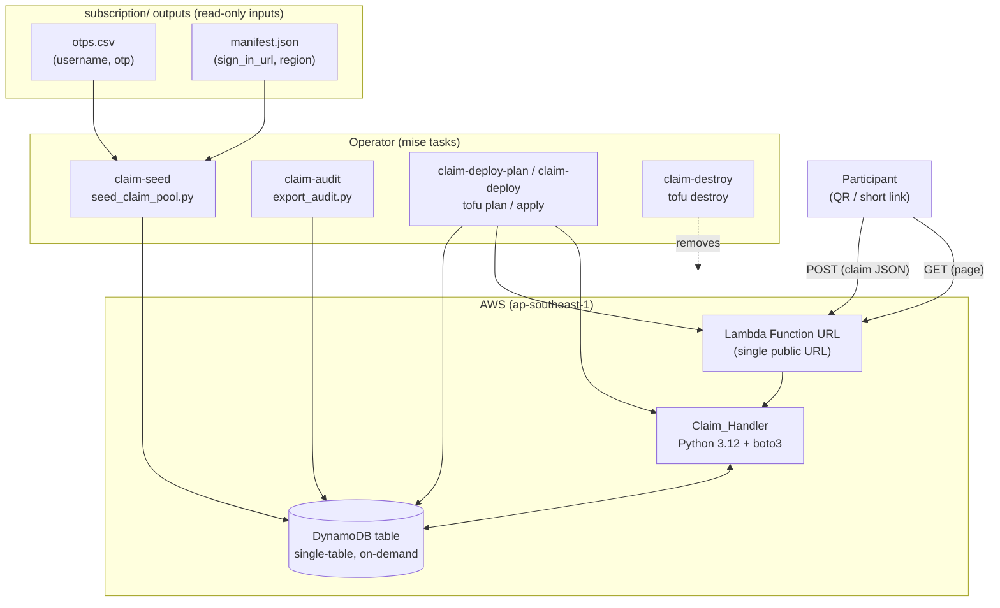
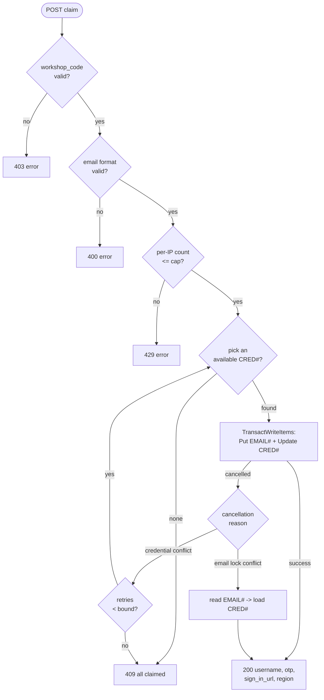

# Design Document

## Overview

The Credential Claim Service distributes pre-provisioned Kiro IAM Identity
Center (IdC) credentials to workshop participants, self-serve, with a hard
guarantee that each credential is claimed at most once and each email claims at
most once. It is a self-contained subtree inside `kiro-provisioning-iac` that
neither alters nor depends on the `subscription/` provisioning flow (Requirement 10) and
is independently destroyable (Requirement 11).

The design follows three clarify-phase refinements that override parts of the
primary source `claim-service/DESIGN.md`:

1. **One Lambda Function URL serves everything.** A single Function URL answers
   `GET` with the claim page HTML and `POST` with the claim operation. There is
   **no S3 bucket, no CloudFront, and no API Gateway** (Requirement 9.1). CORS
   is restricted to the Function URL's own origin (Requirement 12.3). This
   supersedes the "S3 static page + CloudFront" row in DESIGN.md §4 and the
   `frontend/` static-hosting shape in §3.
2. **State reuses the shared bucket.** OpenTofu state lives in the existing
   `kiro-tofu-state-<account_id>` bucket under key
   `claim-service/terraform.tfstate` via a partial backend (`backend.tf`) plus a
   git-ignored `backend.hcl` (with a tracked `backend.hcl.example`). **No new
   backend bootstrap** (Requirement 10.1, 10.2). This supersedes DESIGN.md's
   "own backend" wording (D4) — isolation is achieved by a distinct state *key*,
   not a distinct bucket.
3. **Operator steps are mise tasks** in the root `mise.toml`
   (`claim-seed`, `claim-audit`, `claim-deploy-plan`, `claim-deploy`,
   `claim-destroy`), mirroring `subscription/`'s dry-run-first + approval conventions
   (Requirement 14).

The deployment region is `ap-southeast-1` (Requirement 4.2).

### Design goals and the requirements they serve

| Goal | Mechanism | Requirements |
|------|-----------|--------------|
| Race-proof claims | Single `TransactWriteItems` with two conditional writes; no read-then-write on the claim path | 2.3, 8.1, 8.2, 8.3 |
| One URL, one QR | Lambda Function URL multiplexes GET (page) + POST (claim) | 1.1, 1.2, 9.1 |
| Idempotent re-scan | Catch email-lock conflict → read `EMAIL#` → return same credential | 2.5, 3.1, 3.2 |
| ≈ $0 cost | On-demand DynamoDB, Lambda free tier, no API GW/WAF | 9.1, 9.2, 9.3 |
| Isolation | Distinct state key; no `subscription/` resources referenced | 10.1, 10.3, 11.2 |
| Abuse resistance | Workshop code gate + per-IP cap + CORS lock | 12.1, 12.2, 12.3 |
| PII minimization | Email only in `EMAIL#` item + `claimed_by_email`; git-ignored audit | 13.1, 13.3 |

## Architecture



The participant hits one URL. `GET` returns the inline HTML claim page; the
page's form posts JSON back to the same URL; the `POST` branch performs the
claim. State for the stack lives in the shared S3 bucket under the service's own
key, keeping the stack destroyable without touching the identities created by
`subscription/`.

### Component boundaries

| Layer | Responsibility | Isolation from `subscription/` |
|-------|----------------|-----------------------|
| `claim-service/terraform/` | Table, Lambda, Function URL, IAM role | Own state key; references no `subscription/` resource (10.3) |
| `claim-service/lambda/claim_handler.py` | GET page + POST claim, gate, retry, idempotency | Pure consumer of the table |
| `claim-service/scripts/` | Seed pool, export audit | Reads `subscription/` outputs as plain files; writes only the table / local CSV |
| `claim-service/frontend/index.html` | Served inline by the Lambda | Not deployed to any bucket |

## Components and Interfaces

### Repository layout

```
claim-service/
├── DESIGN.md                     # primary source (existing)
├── README.md                     # operator run order (Requirement 14.4)
├── terraform/
│   ├── backend.tf                # value-free partial `backend "s3" {}`
│   ├── backend.hcl.example       # tracked template for the git-ignored backend.hcl
│   ├── dynamodb.tf               # single table, on-demand
│   ├── lambda.tf                 # function + Function URL + IAM role (least-privilege)
│   ├── variables.tf              # table name, workshop_code, allowed_origin, retry bound, per-IP cap
│   └── outputs.tf                # function_url
├── lambda/
│   └── claim_handler.py          # GET page + POST claim (TransactWriteItems, gate, retry, idempotency)
├── scripts/
│   ├── seed_claim_pool.py        # manifest.json + otps.csv -> PutItem CRED# items
│   └── export_audit.py           # scan EMAIL# items -> git-ignored CSV
└── frontend/
    └── index.html                # inlined into the Lambda at package time
```

Note: there is **no `terraform/backend-bootstrap/`** directory — the shared
bucket already exists (created by the `backend/` stack). This satisfies
Requirement 10.2.

### Function URL and request routing

A single `aws_lambda_function_url` with `authorization_type = "NONE"` (public).
The handler dispatches on the HTTP method from the Function URL event
(`event["requestContext"]["http"]["method"]`):

- `GET` → return the inline claim page (Requirement 1.1).
- `POST` → run the claim pipeline (Requirement 1.2).
- anything else → `405`.

CORS on the Function URL is configured so `allow_origins` is exactly the
Function URL's own origin (Requirement 12.3). Because the page and the endpoint
share an origin, the browser form submission is same-origin; the CORS lock
exists to reject cross-origin scripted abuse.

### Claim_Handler interface (`lambda/claim_handler.py`)

```python
def handler(event, context) -> dict:
    """Function URL entry point. Routes GET -> page, POST -> claim."""

# --- Request helpers -------------------------------------------------------
def render_page(allowed_origin: str) -> dict:
    """200 text/html claim page (email + workshop_code fields)."""

def parse_post(event) -> dict:
    """Parse+validate the JSON body. Raises ClaimError(400) on missing fields."""

def normalize_email(raw: str) -> str:
    """Lowercase + strip. The sole key-derivation for an email (Req 1.5)."""

def is_valid_email(email: str) -> bool:
    """Format-only check: non-empty local part, one '@', non-empty domain (Req 1.3, 13.2)."""

# --- Abuse gate ------------------------------------------------------------
def check_workshop_code(submitted: str, configured: str) -> None:
    """Raise ClaimError(403) if absent/incorrect (Req 12.1)."""

def check_and_increment_ip(ip: str, cap: int) -> None:
    """Atomic counter on RATE#<ip>; raise ClaimError(429) when over cap (Req 12.2)."""

# --- Core claim ------------------------------------------------------------
def claim(email: str) -> dict:
    """Pick-with-bounded-retry + TransactWriteItems. Returns the credential dict.
    Raises ClaimError(409) on exhaustion; routes to reclaim() on email conflict."""

def pick_available() -> str | None:
    """Scan with FilterExpression status = 'available'; return one username or None."""

def reclaim(email: str) -> dict:
    """Idempotent path: read EMAIL# -> load CRED# -> return same credential (Req 3.1)."""
```

`ClaimError` carries an HTTP status and a message; the top-level `handler`
converts it to the JSON error envelope. The claim path performs **no
read-then-write check** on the uniqueness constraints — correctness lives
entirely in the transaction's conditions (Requirement 8.3).

### API contract (served by the Function URL)

`GET <function_url>` → `200 text/html` — the claim page.

`POST <function_url>` with `Content-Type: application/json`:

```json
{ "email": "a@b.com", "workshop_code": "KIRO-WS-7F3A" }
```

| Status | Meaning | Body | Requirements |
|--------|---------|------|--------------|
| `200` | claimed or idempotent re-claim | `{ "username", "otp", "sign_in_url", "region" }` | 4.1, 3.2 |
| `400` | malformed email / missing field | `{ "error": "<msg>" }` | 1.3, 1.4 |
| `403` | bad or missing workshop code | `{ "error": "<msg>" }` | 12.1 |
| `409` | pool exhausted | `{ "error": "all claimed" }` | 5.1 |
| `429` | per-IP attempt cap exceeded | `{ "error": "<msg>" }` | 12.2 |

The pipeline order is: method route → body parse (400) → workshop code (403) →
email format (400) → per-IP cap (429) → claim (200 / 409 / idempotent 200). The
gate checks run **before** any credential-mutating operation so a rejected
request writes nothing (Requirement 12.1).

### Lambda packaging and configuration

- **Runtime:** Python 3.12, handler `claim_handler.handler`. Only `boto3` is
  needed, which is present in the Lambda runtime, so the deployment package is
  the handler plus the inlined `index.html` (read at import time from a sibling
  file bundled into the zip). Memory 128 MB; short timeout (e.g. 10 s).
- **IAM role (least privilege, Requirement — single table):** actions limited to
  `dynamodb:GetItem`, `dynamodb:Scan`, `dynamodb:PutItem`,
  `dynamodb:UpdateItem`, and `dynamodb:TransactWriteItems`, with `Resource`
  scoped to the one table ARN. Plus the managed basic execution role for logs.
- **Environment variables:**

  | Var | Purpose | Requirement |
  |-----|---------|-------------|
  | `TABLE_NAME` | DynamoDB table | all data ops |
  | `WORKSHOP_CODE` | shared gate secret | 12.1 |
  | `ALLOWED_ORIGIN` | Function URL origin for CORS + page | 12.3 |
  | `RETRY_BOUND` | max pick-and-claim retries | 2.4, 5.1 |
  | `PER_IP_CAP` | max POST attempts per source IP | 12.2 |

## Data Models

### Single-table DynamoDB model

One table, partition key `PK` (string), on-demand (`PAY_PER_REQUEST`) capacity
(Requirement 9.2). Three item types distinguished by key prefix.

**Credential item** — one per IdC user, seeded up front:

```
PK               = "CRED#<username>"
username         = <string>
otp              = <string>
sign_in_url      = <string>
region           = "ap-southeast-1"
status           = "available" | "claimed"
claimed_by_email = <normalized_email>   (absent until claimed)
claimed_at       = <iso8601>            (absent until claimed)
```

**Email-lock item** — written at claim time to enforce one-per-email:

```
PK          = "EMAIL#<normalized_email>"
username    = <the credential they got>
claimed_at  = <iso8601>
```

**Rate item** — per-IP attempt counter (Requirement 12.2):

```
PK      = "RATE#<source_ip>"
count   = <number>          (atomic ADD on each POST)
ttl     = <epoch seconds>   (DynamoDB TTL auto-expires the counter)
```

A `GSI` is unnecessary at workshop scale (tens of items); `pick_available()`
uses a `Scan` with `FilterExpression` `status = :available` and reads one match.
The `RATE#` TTL keeps the table self-cleaning and free-tier friendly — no
separate store.

### The claim transaction (correctness core)

A single `TransactWriteItems` with two conditional writes that commit or abort
together (Requirement 2.3):

1. **Put** `EMAIL#<normalized_email>` with
   `ConditionExpression = attribute_not_exists(PK)` — fails if this email
   already claimed (enforces one-per-email, Requirement 2.2 / 8.2).
2. **Update** `CRED#<username>` setting `status = "claimed"`,
   `claimed_by_email`, `claimed_at`, with
   `ConditionExpression = status = "available"` — fails if the credential was
   taken between pick and write (enforces one-per-credential, Requirement 2.1 /
   8.1).

Because both are in one transaction, concurrent requests can neither
double-assign a credential nor let an email claim twice; there is no
check-then-act window (Requirement 8.3).

### Claim decision flow



`TransactionCanceledException` carries a list of `CancellationReasons` aligned
to the transaction items. The handler inspects them:

- **Email-lock item reason is `ConditionalCheckFailed`** → the email already
  claimed → idempotent re-claim: read `EMAIL#<email>`, load its `CRED#`, return
  that same credential with `200` (Requirements 2.5, 3.1, 3.2).
- **Credential item reason is `ConditionalCheckFailed`** (email lock would have
  succeeded) → a lost pick race → retry `pick_available()` up to `RETRY_BOUND`
  (Requirement 2.4).
- **No available credential found / retries exhausted** → `409` and no item is
  created or modified (Requirements 5.1, 5.2).

If both reasons are `ConditionalCheckFailed`, the email-lock conflict wins
(idempotent re-claim), since an already-claimed email must always get its own
credential back regardless of what was picked.

### Seed script (`seed_claim_pool.py`)

Reads `username,otp` rows from `otps.csv` and `sign_in_url` + `region` from
`manifest.json` (the same `subscription/` outputs used by `provision.py`). For each valid
row, `PutItem` a `CRED#<username>` with `status = "available"` (Requirements
6.1, 6.2). A row missing a username or an OTP is reported to stderr and skipped
— no item written for it (Requirement 6.3). The put is itself conditional
(`attribute_not_exists(PK)`) so re-running the seed does not clobber an
already-claimed credential.

### Audit export script (`export_audit.py`)

`Scan` the table with `FilterExpression begins_with(PK, "EMAIL#")`, and for each
`EMAIL#` item emit a CSV row `email,username,claimed_at` (Requirement 7.1). The
email is recovered by stripping the `EMAIL#` prefix from `PK`. Output is written
to a path excluded from version control (Requirements 7.2, 13.3), e.g.
`claim-service/output/audit-<timestamp>.csv`, with the directory added to
`.gitignore`.

### Frontend (`frontend/index.html`, served inline)

A single HTML document bundled into the Lambda zip and returned on `GET`. It
contains an email input and a workshop-code input (Requirement 1.1), posts the
two fields as JSON to the same URL via `fetch`, and renders either the returned
credential (username, OTP, sign-in URL, region) or the error message from the
response body. No external assets, no CDN — the page is self-contained so the
single Function URL is the only moving part.

## Error Handling

| Condition | Detection | Response | Side effects |
|-----------|-----------|----------|--------------|
| Missing `email`/`workshop_code` field | `parse_post` | 400 | none |
| Malformed email | `is_valid_email` false | 400 | none (no `EMAIL#` written, Req 1.3) |
| Wrong/absent workshop code | `check_workshop_code` | 403 | none (Req 12.1) |
| Per-IP cap exceeded | `check_and_increment_ip` | 429 | counter incremented only |
| Pool exhausted / retries spent | `pick_available` None / bound hit | 409 | none (Req 5.2) |
| Email already claimed | `TransactionCanceledException` email-lock reason | 200 (same credential) | none new (Req 3.2) |
| Credential taken mid-pick | `TransactionCanceledException` credential reason | retry, then 409 | none until a clean transaction |
| Unexpected error | catch-all | 500 generic | logged, no PII in logs |

The gate order guarantees that any rejection before `claim()` writes nothing to
the credential or email-lock items. The handler logs operational detail but
never logs OTPs or raw emails beyond the normalized key needed for the claim.

## Security Considerations

- **Public Function URL + gate.** `authorization_type = NONE` makes the URL
  publicly reachable (needed for a QR-driven workshop). The barriers are the
  workshop-code check (403) and the per-IP attempt cap (429), consistent with
  Requirement 12 and DESIGN.md D1. This is acceptable for a time-boxed workshop;
  WAF is explicitly out of scope (Requirement 9.3).
- **CORS lock.** `allow_origins` is the Function URL's own origin only
  (Requirement 12.3), so a page hosted elsewhere cannot script the endpoint from
  a browser.
- **Least-privilege IAM.** The execution role can touch only the one table and
  only the five actions the handler needs — no `subscription/` resource is referenced
  (Requirement 10.3).
- **PII minimization.** A normalized email is stored only in the `EMAIL#` item
  and in `claimed_by_email`; nowhere else (Requirement 13.1). The audit export
  is git-ignored (Requirements 7.2, 13.3). Email validation is format-only with
  no verification round trip (Requirement 13.2).
- **Isolation.** A distinct state key means `tofu destroy` on this stack removes
  the table, Lambda, and Function URL (Requirement 11.1) and cannot touch IdC
  identities, which live in `subscription/`'s separate state (Requirement 11.2).

## Operator workflow (mise tasks)

Added to the root `mise.toml`, mirroring `subscription/`'s dry-run-first + approval
conventions (Requirement 14). Deploy/destroy tasks run `tofu` without
`-auto-approve` so OpenTofu prompts before mutating (Requirement 14.3).

| Task | Action | Requirement |
|------|--------|-------------|
| `claim-seed` | `python seed_claim_pool.py` → populate the pool | 6, 14.1 |
| `claim-audit` | `python export_audit.py` → git-ignored CSV | 7, 14.1 |
| `claim-deploy-plan` | `tofu init -backend-config=backend.hcl && tofu plan` (reports, applies nothing) | 14.1, 14.2 |
| `claim-deploy` | `tofu apply` (prompts) | 14.1, 14.3 |
| `claim-destroy` | `tofu destroy` (prompts) | 11, 14.1, 14.3 |

The service `README.md` documents the run order: deploy-plan → deploy → seed →
(workshop runs) → audit → destroy (Requirement 14.4).

`.gitignore` gains an entry for the audit output directory
(`claim-service/output/`) so exported CSVs never enter version control
(Requirements 7.2, 13.3), and `claim-service/terraform/backend.hcl` so the
account-specific backend config stays local (mirroring `subscription/`).

## Correctness Properties

*A property is a characteristic or behavior that should hold true across all
valid executions of a system — essentially, a formal statement about what the
system should do. Properties serve as the bridge between human-readable
specifications and machine-verifiable correctness guarantees.*

### Property 1: Malformed emails are rejected without a write

*For any* submitted email string that lacks a non-empty local part, a single
`@` separator, or a non-empty domain, the Claim_Handler returns HTTP 400 and
creates no Email_Lock_Item and modifies no Credential_Item.

**Validates: Requirements 1.3**

### Property 2: Email normalization is idempotent and is the sole key

*For any* email string, normalizing it (lowercase + trim) is idempotent
(`normalize(normalize(e)) == normalize(e)`), and every DynamoDB key or attribute
derived from that email in a claim uses exactly the normalized form.

**Validates: Requirements 1.5, 13.1**

### Property 3: No credential is double-assigned

*For any* set of concurrent claims targeting the same Credential_Item, that
Credential_Item is assigned to at most one Normalized_Email.

**Validates: Requirements 2.1, 8.1**

### Property 4: No email claims twice

*For any* set of concurrent claims submitting the same Normalized_Email, at most
one Email_Lock_Item exists for that email and at most one Credential_Item is
assigned to it.

**Validates: Requirements 2.2, 8.2**

### Property 5: Credential conflicts retry within the bound

*For any* sequence of lost pick races in which the chosen Credential_Item is
taken between pick and transaction, the Claim_Handler retries against other
available credentials and performs at most `RETRY_BOUND` attempts before
reporting exhaustion.

**Validates: Requirements 2.4**

### Property 6: Re-claim is idempotent

*For any* Normalized_Email that already holds an Email_Lock_Item, resubmitting
that email returns HTTP 200 with the same credential (username, otp,
sign_in_url, region) and assigns no second Credential_Item.

**Validates: Requirements 2.5, 3.1, 3.2**

### Property 7: Successful claims return the assigned credential's fields

*For any* successful claim of a Credential_Item, the HTTP 200 body contains that
item's `username`, `otp`, `sign_in_url`, and `region`, with `region` equal to
`ap-southeast-1`.

**Validates: Requirements 4.1, 4.2**

### Property 8: Exhaustion returns 409 and mutates nothing

*For any* claim attempt made when no Credential_Item with `status = "available"`
remains after the retry bound, the Claim_Handler returns HTTP 409 and creates or
modifies no Credential_Item and no Email_Lock_Item.

**Validates: Requirements 5.1, 5.2**

### Property 9: Seeding writes one available credential per valid row

*For any* `otps.csv` whose rows each carry a non-empty username and OTP, the
Seed_Script writes exactly one Credential_Item per row keyed `CRED#<username>`
with `status = "available"`.

**Validates: Requirements 6.2**

### Property 10: Invalid seed rows are reported and skipped

*For any* `otps.csv` row missing a username or an OTP, the Seed_Script reports
the row and writes no Credential_Item for it.

**Validates: Requirements 6.3**

### Property 11: The audit export covers every claimed email

*For any* set of Email_Lock_Items in the table, the Audit_Export contains
exactly one row per item mapping its Normalized_Email to the item's `username`
and `claimed_at`.

**Validates: Requirements 7.1**

### Property 12: A bad workshop code is rejected without a write

*For any* POST whose workshop code is absent or not equal to the configured
Workshop_Code, the Claim_Handler returns HTTP 403 and creates no Email_Lock_Item
and modifies no Credential_Item.

**Validates: Requirements 12.1**

### Property 13: The per-IP cap triggers 429

*For any* source IP address, once the number of claim attempts from that IP
exceeds the configured per-IP cap, further attempts from that IP return HTTP
429, while attempts from other IP addresses are unaffected.

**Validates: Requirements 12.2**

### Property 14: Email is stored only in the two permitted places

*For any* successful claim, the Normalized_Email appears in the written items
only as the `EMAIL#` item's key and as the Credential_Item's `claimed_by_email`
attribute, and nowhere else.

**Validates: Requirements 13.1**

## Testing Strategy

**Dual approach.** Unit tests pin down specific examples, structural call
shapes, and edge cases; property tests exercise the universal properties above
across generated inputs. Property tests run a minimum of 100 iterations and are
tagged `Feature: credential-claim-service, Property {n}: {text}`.

### Unit tests (handler, mocked DynamoDB)

Using `moto` (or a stubbed boto3 client) to back the table in-memory:

- **GET branch** returns 200 `text/html` with an email field and workshop-code
  field (Requirement 1.1).
- **Single-transaction shape**: a successful claim issues exactly one
  `transact_write_items` call containing the conditional `Put`
  (`attribute_not_exists(PK)`) and conditional `Update` (`status = available`),
  and performs no read-then-write on the uniqueness check (Requirements 2.3,
  8.3).
- **Missing-field** POST bodies → 400 (Requirement 1.4).
- **No email verification** round trip is performed (Requirement 13.2).
- **Exhaustion**: all-claimed pool → 409 with zero write calls (Requirement
  5.2).

### Property tests (mocked DynamoDB)

One test per correctness property, driving generated inputs:

- Malformed-email generator → Property 1.
- Case/whitespace email generator → Property 2.
- Bounded-retry simulation (transaction cancels on credential conflict K times)
  → Property 5.
- Pre-seeded email generator → idempotent re-claim, Property 6.
- Random seeded pools → success-response contents, Property 7; exhaustion,
  Property 8.
- Generated `otps.csv` rows (valid and invalid) → seed Properties 9, 10.
- Generated `EMAIL#` item sets → audit Property 11.
- Wrong/absent code generator → Property 12.
- Repeated attempts per IP → cap Property 13.
- Written-item inspection → PII placement Property 14.

### Race / concurrency test (the correctness core)

A dedicated concurrency test backs Properties 3 and 4: launch many claims
against a small pool from a thread pool, half submitting the **same** email and
half contending for the **same** credential. Assert the post-conditions:

- no `username` is bound to two distinct emails (Property 3 / Requirement 8.1);
- at most one `EMAIL#` item exists per email and at most one credential is
  assigned to it (Property 4 / Requirement 8.2).

This test relies on the real conditional-write semantics (via `moto`'s
transaction support or a lightweight in-memory model that honors the two
conditions atomically) rather than on timing.

### Infrastructure checks (smoke, not property tests)

Terraform/OpenTofu configuration assertions are verified by plan/snapshot
inspection, not property tests (per the PBT guidance that IaC is declarative,
not input-varying): one `aws_lambda_function_url` and no API Gateway resources
(Requirement 9.1); `billing_mode = PAY_PER_REQUEST` (Requirement 9.2); no WAF /
always-on compute (Requirement 9.3); backend key `claim-service/terraform.tfstate`
and bucket `kiro-tofu-state-<account_id>` with a value-free `backend.tf` and a
tracked `backend.hcl.example`, and no bootstrap directory (Requirements 10.1,
10.2); the five mise tasks present with deploy/destroy prompting (Requirements
14.1–14.3); and the audit output directory listed in `.gitignore` (Requirements
7.2, 13.3).
